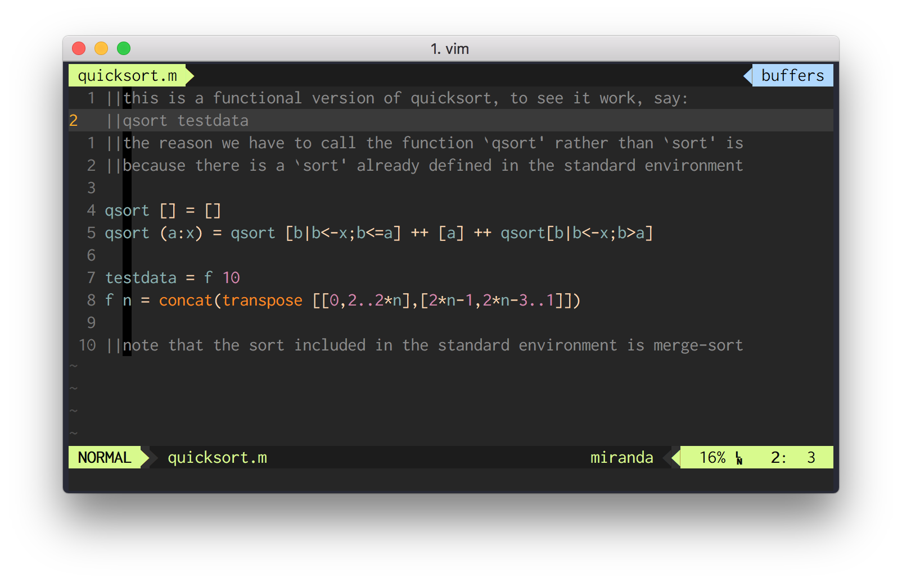

# Miranda Language Syntax highlighter for vim

This is an experimental attempt at highlighting [Miranda](https://en.wikipedia.org/wiki/Miranda_(programming_language)) files while using vim.

I hope this is helpful to other people and Pull Requests are welcome!



## Installation Instructions

*Vundle:* Place this in your .vimrc:

```sh
Plugin 'tpope/vim-fugitive'
# … then run the following in Vim:

:source %
:PluginInstall
```
